# 💻 Ikrama | Full Stack Developer · MERN · Next.js · GSAP

---

<!-- BANNER SVG — Replace this URL after you upload dark.svg to your repo -->

  

---

## 🧠 About Me:

👋 Hi, I'm **Ikrama** — a 24-year-old developer from **Pakistan 🇵🇰**

🎓 Enrolled in **IBM Full Stack Software Engineer** course on Coursera  
🏢 **Frontend Development Intern** @ Decode Labs (Remote)  
💼 **Freelance WordPress Developer** on Fiverr (Elementor Pro · WooCommerce · Landing Pages)  
🚀 Building cool projects with **MERN · Next.js · TypeScript · GSAP · AI APIs**  
🤖 Currently building **Dino Delivery** — an AI-powered WhatsApp bot (Node.js + Gemini + Meta API)  
🛠️ Recent projects: **BurgerDrop · Employee Management System · Teacher Test Maker · Node Cleaner**  
📢 **Building in Public** on LinkedIn → [@Ikdeveloper](https://linkedin.com/in/ikdeveloper)  
🐙 GitHub → [@Ikdevelopers](https://github.com/Ikdevelopers)  
🎯 Portfolio: *Coming Soon*  
📫 Contact: [connectikrama@gmail.com](mailto:connectikrama@gmail.com)

---

## 🌐 Socials:

---

## 💻 Tech Stack:

**Frontend**

**Backend & Database**

**AI & Tools**

---

## 🚀 Featured Projects:

| Project | Description | Tech |
|--------|-------------|------|
| 🚚 **Delivery Automation System** | End-to-end delivery management — order tracking, driver assignment & real-time status updates | Node.js · Express · MongoDB · React |
| 👨‍💼 **Employee Management System** | Full-stack HR tool for managing records, attendance, roles & payroll for small businesses | Next.js · MongoDB · Tailwind · TypeScript |
| 🍔 **BurgerDrop** | KFC-style fast food website — menu showcase, cart system & smooth animations | React · Tailwind · GSAP · Node.js |
| 📝 **Teacher Test Maker** | Full MERN/Next.js migration of a static test-maker web app | Next.js · App Router · Tailwind · MongoDB |
---

## 📊 GitHub Stats:

  
  &nbsp;
  

  

---

  <i>✨ "Build things. Break things. Learn. Repeat." 🚀</i>

